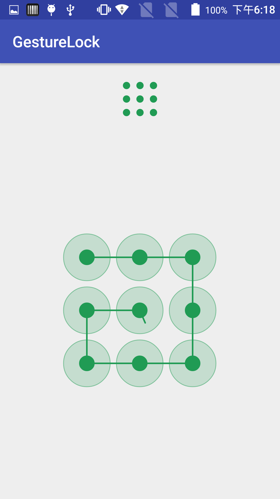
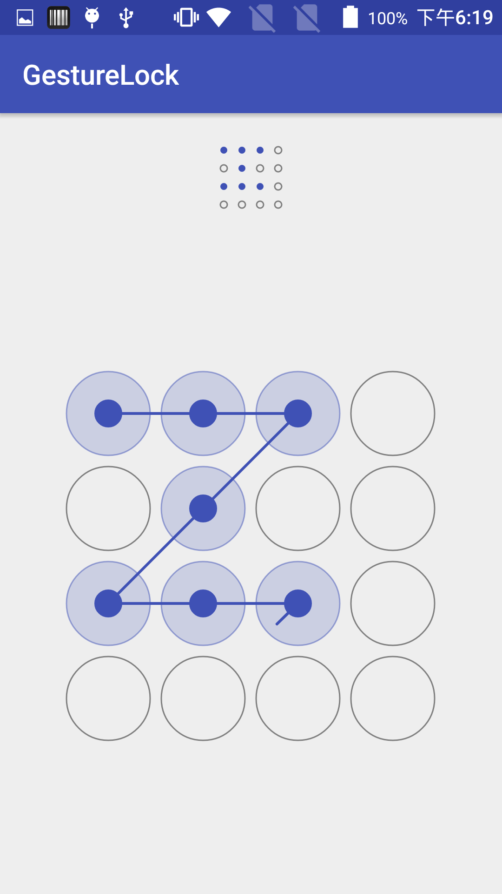

# GestureLock

## 自定义属性
```xml
<?xml version="1.0" encoding="utf-8"?>
<resources>
    <!-- 圆形的个数 -->
    <attr name="circleCount" format="integer" />
    <!-- 圆的半径 -->
    <attr name="circleRadius" format="dimension" />
    <!-- 圆的间距 -->
    <attr name="circleSpace" format="dimension" />
    <!-- 正常状态下的圆的颜色 -->
    <attr name="colorNormal" format="color" />
    <!-- 选中状态下的圆的颜色 -->
    <attr name="colorSelected" format="color" />
    <!-- 圆的弧线宽度 -->
    <attr name="strokeWidth" format="dimension" />

    <declare-styleable name="GestureLockView">
        <!-- 圆形的个数 -->
        <attr name="circleCount" />
        <!-- 圆的半径 -->
        <attr name="circleRadius" />
        <!-- 圆的间距 -->
        <attr name="circleSpace" />
        <!-- 正常状态下的圆的颜色 -->
        <attr name="colorNormal" />
        <!-- 选中状态下的圆的颜色 -->
        <attr name="colorSelected" />
        <!-- 正确状态下的圆的颜色 -->
        <attr name="colorSelectedRight"  format="color" />
        <!-- 错误状态下的圆的颜色 -->
        <attr name="colorError" />
        <!-- 延时重置，单位毫秒 -->
        <attr name="delayReset" format="integer" />
        <!-- 是否显示手势路径 -->
        <attr name="gesturePathVisible" format="boolean" />
        <!-- 内圆的半径，默认为圆的半径的三分之一 -->
        <attr name="innerCircleRadius" format="dimension" />
        <!-- 圆的弧线宽度 -->
        <attr name="strokeWidth"/>
    </declare-styleable>

    <declare-styleable name="GestureLockPreview">
        <!-- 圆形的个数 -->
        <attr name="circleCount" />
        <!-- 圆的半径 -->
        <attr name="circleRadius" />
        <!-- 圆的间距 -->
        <attr name="circleSpace" />
        <!-- 正常状态下的圆的颜色 -->
        <attr name="colorNormal" />
        <!-- 选中状态下的圆的颜色 -->
        <attr name="colorSelected" />
        <!-- 圆的弧线宽度 -->
        <attr name="strokeWidth"/>
    </declare-styleable>

</resources>
```

## 默认样式
```xml
<?xml version="1.0" encoding="utf-8"?>
<resources>

    <style name="DefaultGestureLockView">
        <item name="circleCount">3</item>
        <item name="circleRadius">30dp</item>
        <item name="circleSpace">8dp</item>
        <item name="colorNormal">#7f7f7f</item>
        <item name="colorSelected">#209b54</item>
        <item name="colorSelectedRight">#209b54</item>
        <item name="colorError">#FF0000</item>
        <item name="gesturePathVisible">true</item>
        <item name="delayReset">1000</item>
        <item name="strokeWidth">1dp</item>
    </style>

    <style name="DefaultGestureLockPreview">
        <item name="circleCount">3</item>
        <item name="circleSpace">8dp</item>
        <item name="colorNormal">#7f7f7f</item>
        <item name="colorSelected">#209b54</item>
        <item name="strokeWidth">1dp</item>
    </style>

</resources>
```
## 屏幕截图
### 3x3样式
 
 
 

### 4x4样式
 
 
 
 
